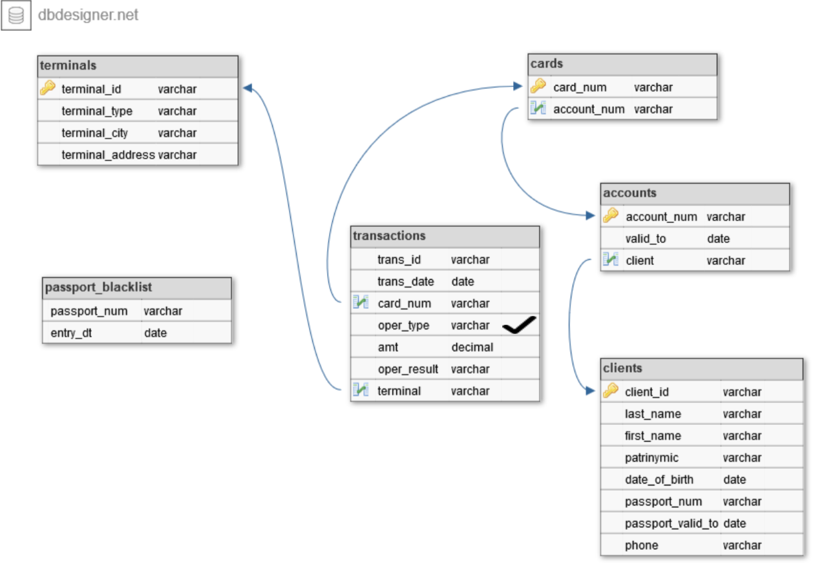

## Финальный индивидуальный проект Школы IT от Сбера по направлению Data Engineering

Суть проекта – разработать ETL процесс, получающий ежедневную выгрузку данных (предоставляется за 3 дня), 
загружающий ее в хранилище данных и ежедневно строящий отчет по поиску мошенников в потоке транзакций.

### Выгрузка данных.
Ежедневно некие информационные системы выгружают следующие файлы:
  1. Список транзакций за текущий день. Формат – CSV.
  2. Список терминалов полным срезом. Формат – XLSX.
  3. Список паспортов, включенных в «черный список» - с накоплением с
  начала месяца. Формат – XLSX.
  Сведения о картах, счетах и клиентах хранятся в схеме BANK.

### Структура хранилища.

Ко всем таблицам SCD1 добавлены технические поля create_dt, update_dt. Ко всем таблицам SCD2 добавлены технические поля effective_from, effective_to, deleted_flg.

### Построение отчета.
По результатам загрузки ежедневно необходимо строить витрину отчетности по мошенническим операциям.
Витрина строится накоплением, каждый новый отчет укладывается в эту же таблицу с новым report_dt.
В витрине должны содержаться следующие поля: event_dt, passport, fio, phone, event_type, report_dt.

### Признаки мошеннических операций.
  1. Совершение операции при просроченном или заблокированном паспорте.
  2. Совершение операции при недействующем договоре.
  3. Совершение операций в разных городах в течение одного часа.
  4. Попытка подбора суммы. В течение 20 минут проходит более 3х операций со следующим шаблоном – каждая последующая меньше предыдущей, при этом отклонены все кроме последней. Последняя операция (успешная) в такой цепочке считается мошеннической.

### Обработка файлов
Выгружаемые файлы именуются согласно следующему шаблону:
  - transactions_DDMMYYYY.txt
  - passport_blacklist_DDMMYYYY.xlsx
  - terminals_DDMMYYYY.xlsx
  
Предполагается что в один день приходит по одному такому файлу.
После загрузки соответствующего файла он должен быть переименован в файл с расширением .backup чтобы при следующем запуске файл не искался и перемещен в каталог archive:
  - transactions_DDMMYYYY.txt.backup
  - passport_blacklist_DDMMYYYY.xlsx.backup
  - terminals_DDMMYYYY.xlsx.backup

 Подробнее задание и систему оценивания смотреть в "Индивидуальный проект.pdf"
 
 ### Репозиторий задания:
 https://github.com/HaykInanc/sql_project
